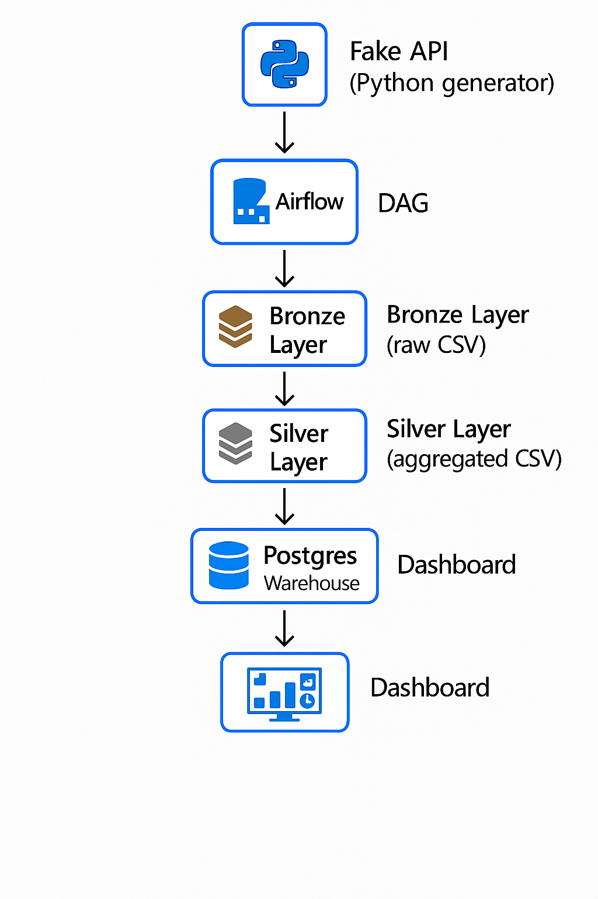

## 🏗️ Architecture Diagram

Below is the Azure-style Medallion Architecture diagram of this project:

Rideshare Data Engineering Pipeline
Medallion Architecture (Bronze → Silver → Gold) with Airflow, Python & PostgreSQL

This project is a complete end-to-end data engineering pipeline inspired by Azure’s Medallion Architecture.
It uses Apache Airflow as the orchestrator, Python for all ETL transformations, CSV layers as a local Data Lake, and PostgreSQL as the final warehouse.

The pipeline simulates a rideshare system by generating fake data, cleaning it, aggregating it, and loading the results into a warehouse for analytics or dashboarding.

🏗️ Architecture Diagram

🔷 Pipeline Overview

This project follows the industry-standard Medallion Architecture, commonly used in Azure Data Lake and Databricks pipelines.

🟫 Bronze Layer — Raw Data

Generated by a Python-based fake API

Contains uncleaned raw rideshare records

Stored as: rides_raw.csv

⬜ Silver Layer — Cleaned Data

Duplicate removal

Missing value handling

Enrichment (total fare, fare per km)

Timestamp normalization

Stored as: rides_clean.csv

🟨 Gold Layer — Aggregated Data

Aggregated analytics by driver:

Total rides

Total earnings

Total distance

Average fare

Average tip

Stored as: rides_agg.csv

🗄️ Warehouse: PostgreSQL

Final Gold dataset is loaded into:

Table: rides_analytics

This can be connected to Power BI, Metabase, or any BI tool.

bronze_extract_raw
        ↓
silver_clean_data
        ↓
gold_aggregate_data
        ↓
load_to_postgres
The DAG runs daily (@daily) and orchestrates the full Medallion data flow.

Tech Stack

Apache Airflow

Python (Pandas)

Docker & Docker Compose

PostgreSQL

Azure-style Medallion Architecture

CSV-based Local Data Lake

Future Enhancements

Convert data layers from CSV → Parquet

Introduce Delta Lake format

Add Great Expectations for data validation

Add Power BI / Metabase Dashboard

Migrate to Azure Data Factory + ADLS + Synapse

Add CI/CD with GitHub Actions

Add unit tests for ETL scripts